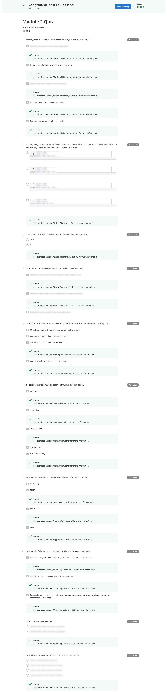

# Coursera: Screenshots of Quizzes and Assignments

Quick and dirty CLI tool to capture assignments solutions from Coursera courses.

## Why? 

If you are like me you love Coursera and their online courses.
Because you love them you probably do **a lot of them**.
You might be interested in keeping a copy of your quizzes and assignments next to your certificates for future reference.

This repository contains code to create full-page screenshots from courses which is hard to do because of the HTML page layout that coursera has been chosen for quizzes and assignments.

This tool uses [puppeteer](https://github.com/puppeteer/puppeteer/) to discover, fetch and manipulate the solution pages and then take full-screen snapshots of them.

## Get started

I'll use conda to setup a node environment.
You can also use [nvm](https://github.com/nvm-sh/nvm) or your default node environment - whatever you like.
Just leave out the conda steps in those cases.

```bash
conda create -p ./.conda-env nodejs
conda activate ./.conda-env

# sanity check
which node   # should point to the node executable in the .conda-env folder
```

Install all node dependencies:

```bash
npm install
npm link      # symlink executable as ccs
```

## Download solutions for a given course

### Authentication

To authenticate against Coursera's webservers please copy the `CAUTH` cookie value.
To do so go to [the Coursera website](https://coursera.org) and perform the following steps:

1. Login with your credentials
1. Open the developer tools (Shortcut: `Ctrl + Shift + i`)
1. Go to Storage -> Cookies and search for a cookie with the name `CAUTH`
4. Copy the value to your clipboard

Now export this value in a terminal as a variable with the name `CAUTH`:

```bash
export CAUTH="your value goes here"
```

**Note**: Be careful where to copy and paste this token.
The token is identical to your username/password combination and should NEVER be published to any site, blog, git, Facebook, whatever. NEVER. EVER!

### Use the CLI tool

Let's assume you have finished the course [Introduction to Data Science in Python](https://www.coursera.org/learn/python-data-analysis/home/welcome) and you want to download all your solutions.
Have a look at the URL: https://www.coursera.org/learn/python-data-analysis/home/welcome.
The part between `learn/` and `/home`, in this case `python-data-analysis`, is the course ID which will be required in the next step.

Downloading the solutions is a simple call

```bash
ccs --courseId sql-for-data-science

# use the courseId flag multiple times for downloading solutions of multiple courses
ccs --courseId sql-for-data-science --courseId python-data-analysis
```

The tool will determine all assignments automatically and download your solutions.
By default the download directory will be `/tmp/coursera-capture-solutions/$COURSE_ID` (this can be adjusted with the `--outputDir` flag).
In this directory you will find a set of PNG files with full-page screenshots of the solution.

A sample solution could look like this (some parts have been blurred, because I don't want to spoiler all solutions ;) ).



Have fun!
